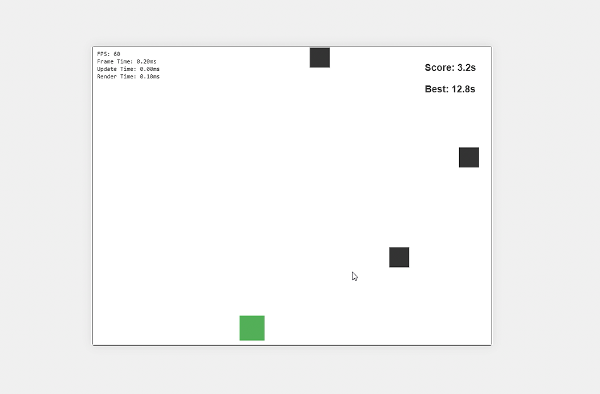

# Dodge-a-Block

A fast-paced browser game where you dodge falling blocks to survive as long as possible. Built with TypeScript, HTML5 Canvas, and modern web technologies.


 

## Features

- 🎮 Simple, addictive gameplay
- 📈 Progressive difficulty with increasing block speed
- 🏆 High score tracking with local storage
- 📊 Detailed game statistics
- ⚡ Optimized performance with object pooling and spatial partitioning
- 🎨 Smooth animations and visual effects
- 📱 Responsive design for various screen sizes

## Getting Started

### Prerequisites

- Node.js (v14 or higher)
- npm (v6 or higher)

### Installation

1. Clone the repository:
   ```bash
   git clone https://github.com/yourusername/dodge-a-block.git
   cd dodge-a-block
   ```

2. Install dependencies:
   ```bash
   npm install
   ```

3. Start the development server:
   ```bash
   npm start
   ```

4. Open your browser and navigate to `http://localhost:9000`

### Building for Production

To create a production build:

```bash
npm run build
```

The optimized files will be available in the `dist` directory.

## How to Play

- Use the **Left Arrow** or **A** key to move left
- Use the **Right Arrow** or **D** key to move right
- Press **Space** to start a new game or restart after game over
- Dodge the falling blocks to survive
- Your score increases based on survival time
- Block speed increases every 10 seconds
- Try to beat your high score!

## Technical Details

### Architecture

The game is built using a modular architecture with the following key components:

- `Game`: Main game loop and state management
- `Player`: Player movement and controls
- `BlockManager`: Block spawning and management with object pooling
- `CollisionSystem`: Efficient collision detection using spatial partitioning
- `ScoreManager`: Score tracking and high score persistence
- `PerformanceMonitor`: Performance tracking and optimization

### Performance Optimizations

1. **Object Pooling**
   - Reuses block objects to reduce garbage collection
   - Automatically grows pool size as needed
   - Efficient memory management

2. **Spatial Partitioning**
   - Grid-based collision detection
   - Reduces collision checks to nearby objects
   - Scales well with many objects

3. **Rendering Optimizations**
   - Efficient canvas rendering
   - Minimal state changes
   - Smooth animations

4. **Memory Management**
   - Object reuse
   - Minimal allocations during gameplay
   - Automatic cleanup

### Statistics and Debugging

The game includes detailed statistics tracking:

- FPS and frame timing
- Memory usage
- Object counts
- Collision statistics
- Performance metrics

In development mode (NODE_ENV=development), debug information is displayed on screen.

## Contributing

Contributions are welcome! Please feel free to submit a Pull Request.

1. Fork the repository
2. Create your feature branch (`git checkout -b feature/AmazingFeature`)
3. Commit your changes (`git commit -m 'Add some AmazingFeature'`)
4. Push to the branch (`git push origin feature/AmazingFeature`)
5. Open a Pull Request

## Development Guidelines

- Use TypeScript for all new code
- Follow existing code style and formatting
- Add comments for complex logic
- Update documentation for new features
- Include tests for new functionality

## License

This project is licensed under the MIT License - see the [LICENSE](LICENSE) file for details.

## Acknowledgments

- Built with TypeScript and HTML5 Canvas
- Developed using modern web development practices
- Inspired by classic arcade games 